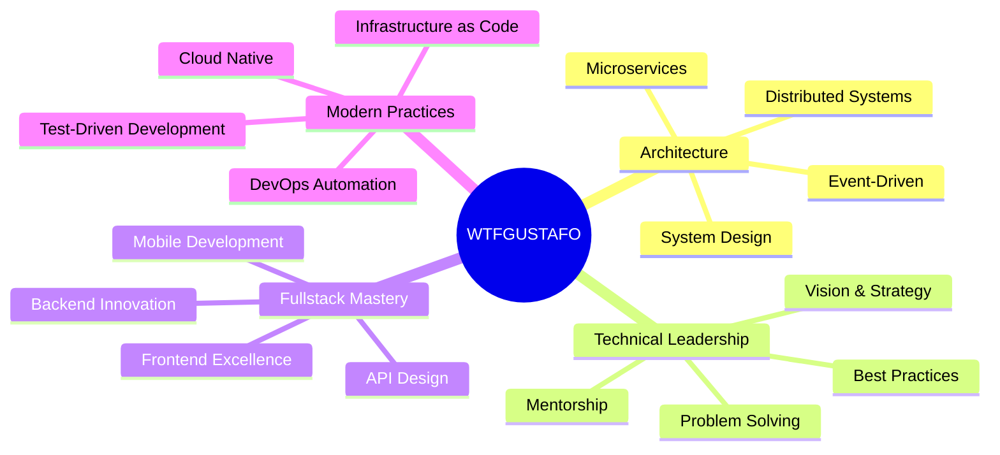

<!-- HEADER ANIMATION -->

  

<!-- ANIMATED CONTRIBUTION SNAKE -->

  

  

  

    
    
    
  

  
  

<!-- ANIMATED SEPARATOR -->

  

<h1 align="center">
   
  About Me
  
</h1>

  <table>
    <tr>
      <td width="50%">
        
      </td>
      <td width="50%">
        
I'm a <b>software architect and fullstack developer</b> with exceptional technical depth and a passion for creating elegant solutions to complex problems.

        
My technical approach combines cutting-edge technologies with battle-tested patterns, resulting in systems that are both innovative and robust.

        
I don't just write code—I craft experiences that delight users and empower businesses.

        

           <strong>Innovation</strong> &nbsp;|&nbsp;
           <strong>Engineering</strong> &nbsp;|&nbsp;
           <strong>Vision</strong>
        

      </td>
    </tr>
  </table>

<!-- ANIMATED SEPARATOR -->

  

<h1 align="center">
   
  Technical Arsenal
  
</h1>

  

  <table>
    <tr>
      <td valign="top" width="33%">
        <h3 align="center">Frontend</h3>
        
  
            
            
            
            
            
            
            
        

      </td>
      <td valign="top" width="33%">
        <h3 align="center">Backend</h3>
        
  
            
            
            
            
            
            
            
        

      </td>
      <td valign="top" width="33%">
        <h3 align="center">DevOps</h3>
        
  
            
            
            
            
            
            
            
        

      </td>
    </tr>
  </table>

<!-- ANIMATED SEPARATOR -->

  

<h1 align="center">
   
  GitHub Analytics
  
</h1>

  

  

  

<!-- ANIMATED SEPARATOR -->

  

<h1 align="center">
  
  Engineering Philosophy
  
</h1>

  

<!-- ANIMATED SEPARATOR -->

  

<h1 align="center">
  
  Always Learning
  
</h1>

  <table>
    <tr>
      <td width="50%">
        
      </td>
      <td width="50%">
        
<strong>Currently exploring:</strong>

        <ul>
          <li> Advanced frontend architecture patterns</li>
          <li> Web performance optimization</li>
          <li> Scalable system design</li>
          <li> Application security</li>
          <li> Serverless architecture</li>
        </ul>
      </td>
    </tr>
  </table>

<!-- ANIMATED SEPARATOR -->

  

<h1 align="center">
  
  Let's Connect
  
</h1>

  

    
    
  

  

<!-- ANIMATED FOOTER -->

  

